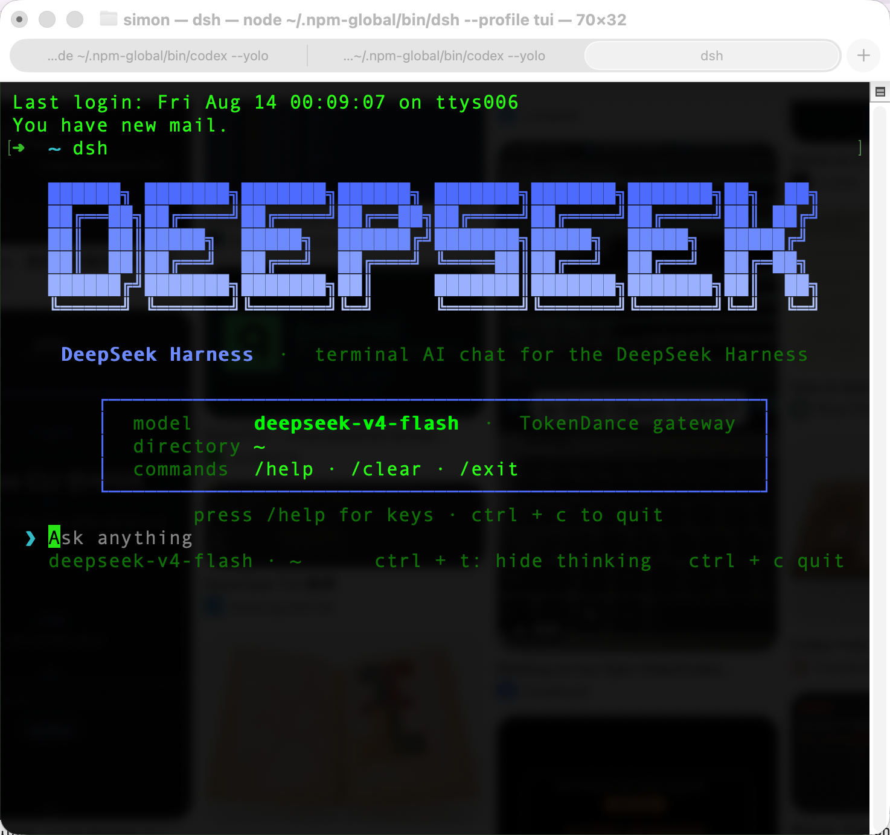

<p align="center"><strong>deepseek-harness-tui</strong> is an interactive terminal chat for the <a href="https://github.com/deepseek-ai/deepseek-harness">DeepSeek Harness</a> (dsh) — a Codex CLI–style experience built with <a href="https://github.com/vadimdemedes/ink">Ink</a> (React for terminals).

<p align="center">
  
</p>

</br>
Install <code>dsh</code> (the harness) and this plugin bundle, then run <code>dsh --profile tui</code> to start chatting with DeepSeek models in your terminal — zero-chrome transcript, tool calls folded into cells, theme derived from your terminal via OSC 11.</p>

---

## Quickstart

### Installing DeepSeek Harness

Install `Node.js` (≥ 20), then install the harness CLI with npm:

```shell
npm install -g @deepseek-ai/dsh
```

No Homebrew tap is available yet — use the npm install above. You can also try it without installing (`npx @deepseek-ai/dsh web`) or build [from source](https://github.com/deepseek-ai/deepseek-harness).

### Installing deepseek-harness-tui

```shell
git clone https://github.com/gxinxing/deepseek-harness-tui
cd deepseek-harness-tui && pnpm install
```

Then wire the plugin bundle into the `tui` profile:

```shell
dsh plugin --profile tui add @deepseek-ai/dsh-headless
dsh plugin --profile tui add /path/to/deepseek-harness-tui
```

### Running

```shell
dsh --profile tui
```

### Using it with TokenDance

Point `TOKENDANCE_API_KEY` at your key — either `export TOKENDANCE_API_KEY=sk-...` or add it to `~/.dsh/.credentials.yaml` (mode `0600`). The default model is `deepseek-official/deepseek-v4-flash`. See [Model routing](#model-routing-tokendance).

## Features

- **Zero-chrome design** — the transcript is the surface; the DeepSeek brand banner shows only on the empty state.
- **Bottom-anchored transcript** — the live viewport always keeps the latest content visible.
- **Tool cells** — `⠋ Running <cmd>` → `✓ <cmd> • 1.2s` (or `✗` on error), with output merged into the cell, dimmed, and truncated (head + tail with a `… +N lines` marker).
- **OSC 11 theme derivation** — user-message tints and code chips are blended from your terminal's real background; looks right in dark and light themes.
- **Thinking folding** — `ctrl + t` toggles the reasoning trace.
- **Esc interrupt** — abort the running turn at any time.
- **Markdown rendering** — headers, fenced code blocks, inline-code chips.
- **CJK-aware wrapping** — correct character widths for CJK and emoji, aligned gutter.

## Keys & commands

| Key | Action |
| --- | --- |
| `ctrl + t` | toggle thinking display |
| `esc` | interrupt the running turn |
| `ctrl + c` | quit |

| Command | Action |
| --- | --- |
| `/help` | show help |
| `/clear` | clear the transcript |
| `/exit`, `/quit` | quit |

## Model routing (TokenDance)

The profile patch (`cordis.patch.yml`) routes `llm-deepseek` through the TokenDance gateway:

```yaml
llm-deepseek:
  apiKeyEnv: TOKENDANCE_API_KEY
  baseURL: https://tokendance.space/gateway/v1
```

### Credentials

- Environment variable: `export TOKENDANCE_API_KEY=sk-...`
- Credentials file (`~/.dsh/.credentials.yaml`, mode `0600`): `TOKENDANCE_API_KEY: sk-...`

### Provider & models

The TokenDance provider is registered in `~/.dsh/settings.yaml` (`llm-pi-ai.providers.tokendance`): OpenAI-compatible endpoint, `thinkingFormat: deepseek`, models `deepseek-v4-flash` and `deepseek-v4-pro`. To switch models, edit the provider's `models` list there or override `llm-deepseek.model` in your profile patch.

> **Prerequisite fix (one-time, per dsh install).** TokenDance streams subsequent tool-call deltas with empty `name`/`id`; the stock `@deepseek-ai/dsh-llm-deepseek` adapter overwrites the first frame's call id with `""` and the harness loops on `unknown tool ""`. Applied the guard in `node_modules/@deepseek-ai/dsh-llm-deepseek/lib/index.js`:
>
> ```diff
> - if (call.id !== void 0) block.callId = call.id
> + if (call.id) block.callId = call.id
> - ... if (call.function?.name !== void 0) ...
> + ... if (call.function?.name) ...
> ```
>
> Applied 2026-08-13 on this machine. This edit lives in the global dsh install and is **lost on `dsh` upgrade** — re-apply after upgrading (worth an upstream PR).

## Docs

- [**INTEGRATION-NOTES**](./INTEGRATION-NOTES.md) — event shapes, patch semantics, integration deep-dive.
- [**DeepSeek Harness**](https://github.com/deepseek-ai/deepseek-harness) — the underlying agent framework.

## Debug

- `DSH_TUI_BG=#ffffff dsh --profile tui` — force a light terminal background for theme testing.

This repository is licensed under the [MIT License](LICENSE).
